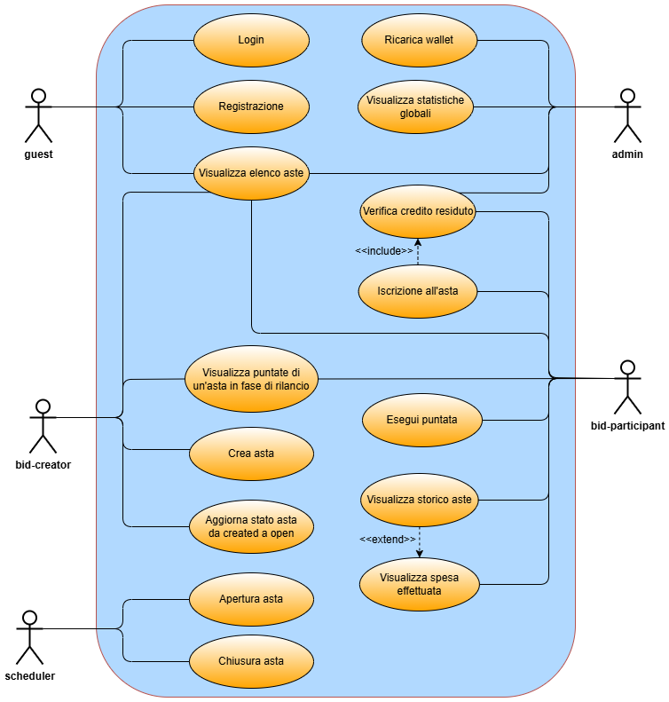

# Progetto di Programmazione Avanzata  
*Sviluppo Backend di un Sistema di Gestione Aste Snap*

---

### Introduzione

Questo progetto ha come obiettivo lo sviluppo del backend per un sistema di **aste snap**, un tipo di asta a prenotazione in cui gli utenti si registrano pagando una quota e competono tramite rilanci in tempo reale.

L’applicazione consente la gestione completa degli utenti, la creazione e partecipazione alle aste, l’invio di offerte in tempo reale tramite **WebSocket**, la gestione dei wallet degli utenti e la tracciabilità delle operazioni.

L’architettura si basa su **Node.js** con il framework **Express** e il linguaggio **TypeScript** per realizzare API REST robuste e scalabili, mentre la persistenza dei dati è affidata a **PostgreSQL**. Le comunicazioni in tempo reale tra server e client sono gestite tramite **WebSocket**, che consentono di aggiornare immediatamente i partecipanti sulle evoluzioni dell’asta.

Le funzionalità principali includono la gestione utenti tramite token **JWT**, il controllo e la gestione del wallet per ogni partecipante, l’iscrizione e il rilancio durante la fase finale dell’asta, l’aggiudicazione automatica degli oggetti, l’esportazione dello storico delle aste e statistiche avanzate per l’amministratore.

Il progetto prevede l’uso di middleware personalizzati per la validazione delle richieste e la gestione centralizzata degli errori, l’adozione di pattern architetturali come Factory, e l’utilizzo di **Sequelize** come ORM per facilitare l’interazione con il database.

Tutti i componenti sono containerizzati utilizzando **Docker** e orchestrati tramite **Docker Compose**, garantendo portabilità, isolamento e semplicità di distribuzione in ambienti diversi.

---

## Descrizione del sistema

Il sistema permette di creare e gestire aste snap secondo le seguenti regole:

### 1. Prenotazione dell’asta

- Ogni asta prevede un numero minimo e massimo di partecipanti.
- Per partecipare è necessario prenotare un posto pagando una quota d’iscrizione.
- Se non viene raggiunto il numero minimo di partecipanti entro il termine stabilito, l’asta viene chiusa, la prenotazione viene annullata e la quota restituita.
- Se il numero minimo viene raggiunto, l’asta entra nella fase di rilancio.

### 2. Fase di rilancio

- I partecipanti iscritti all’asta possono iniziare a rilanciare.
- Ogni partecipante ha un numero limitato di puntate gratuite.
- Ogni puntata aumenta il prezzo corrente dell’asta di un valore fisso predefinito (ad esempio, 1 o 5 centesimi).
- Il prezzo d’asta non può mai superare il prezzo massimo indicato.
- Vince il partecipante che ha effettuato più rilanci. In caso di parità, vince chi ha effettuato l’ultimo rilancio.

## Funzionalità principali

Il sistema prevede le seguenti funzionalità, con autenticazione JWT e autorizzazioni basate sui ruoli:

### Per i partecipanti (`bid-participant`)

- Visualizzazione dell’elenco delle aste, con possibilità di filtrare per stato (create, aperte, in rilancio, concluse).
- Prenotazione di un posto in un’asta aperta, previa verifica del credito disponibile.
- Partecipazione alla fase di rilancio se attiva.
- Visualizzazione dei rilanci attivi per un’asta in cui si è iscritti.
- Gestione del wallet personale, con visualizzazione del credito residuo.
- Visualizzazione dello storico delle aste alle quali si è partecipato, distinguendo tra quelle vinte e non vinte, con possibilità di filtrare per data ed esportare i dati in formato JSON o PDF.
- Visualizzazione delle spese sostenute in un intervallo di tempo, includendo quote d’iscrizione e aggiudicazioni.

### Per i creatori d’asta (`bid-creator`)

- Creazione di una nuova asta specificando i relativi parametri.

### Per gli amministratori (`admin`)

- Ricarica del credito per un utente.
- Visualizzazione di statistiche globali su un intervallo temporale, tra cui:
  - Numero di aste concluse con successo.
  - Numero di aste annullate per mancanza di iscritti.
  - Media del rapporto tra il numero di puntate effettuate e il numero massimo di puntate disponibili.

---

### Installazione

Come prima cosa è necessario clonare il repository di GitHub:

```bash
git clone <URL_DEL_REPO>
```

Oppure scaricarlo come ZIP da GitHub.

Assicurati di avere installato [Docker](https://docs.docker.com/engine/install/). 

Se stai usando Linux:

```bash
sudo service docker start
```

Oppure avvia **Docker Desktop**, che è più intuitivo.
Assicurati di avere tutti i file .env necessari per installare il software

Una volta attivo Docker, spostati nella cartella del progetto e tramite il terminale esegui:

```bash
docker compose up
```

L’applicazione è ora configurata e sarà disponibile su:

- **Backend**: http://localhost:3000  
- **PostgreSQL**: configurato nella rete interna Docker  

**Nota**: al primo avvio il seeding è automatico. Non sono necessarie operazioni sul database

---

### Architettura Backend

L'architettura del backend si basa su un sistema composto da quattro container Docker principali. Il fulcro dell'applicazione è rappresentato dal container che esegue il framework Express, responsabile della logica di business: gestisce le chiamate API, si occupa dell’autenticazione/autorizzazione e interagisce con il database. Data la sua importanza, questo container è connesso direttamente agli altri tre.

Uno di questi è il container che ospita Redis, utilizzato per la gestione delle code di elaborazione. Per implementare questo meccanismo, è stata impiegata la libreria BullMQ, integrata nell’ambiente Node.js, come già anticipato.


L'architettura del backend si compone di:

- **Express Container**: Container con il framework Express, che si occupa di gestire tutta la logica business dell'applicazione, i controller, i DAO e i middleware.
- **PostgreSQL**: database relazionale, gestito tramite Sequelize con modelli ORM per ogni entità.
- **WebSocket Server**: per aggiornamenti in tempo reale su offerte e chiusure aste.

#### Moduli principali

- **Controller**: gestiscono le richieste HTTP.
- **DAO**: interagiscono con il database tramite **Sequelize ORM**.
- **Service (opzionale)**: logica di business (può essere aggiunta per ulteriore separazione).
- **Middleware**: per autenticazione, autorizzazione e validazione, realizzati con il pattern **Chain of Responsibility**.
- **Factory Pattern**: per la gestione centralizzata degli errori.

---

### Express Container Architecture

All’interno del controller vengono prelevati i parametri richiesti dall’operazione direttamente dal corpo della richiesta HTTP. Una volta ottenuti, il flusso viene delegato al livello di servizio, incaricato di gestire la logica applicativa e l’eventuale trattamento degli errori. Questo livello si interfaccia con un ulteriore strato, rappresentato dagli oggetti DAO (Data Access Object), responsabili dell’esecuzione delle operazioni sul database.

I DAO utilizzano i modelli forniti da Sequelize per accedere ai dati, sfruttando il paradigma ORM (Object-Relational Mapping), che consente di astrarre e semplificare l’interazione con il database evitando query SQL verbose.

Una volta completata l’elaborazione — con successo o con un errore — la risposta generata dal servizio viene restituita al controller. A questo punto, entra in gioco un middleware dedicato alla gestione centralizzata degli errori, che si occupa di formattare e inoltrare la risposta finale all’utente.


---

### Diagramma dei Casi d'Uso



---

### Rotte Principali

#### `/auction`

- `POST /` → crea una nuova asta (bid-creator)
    - **Corpo della richiesta**:

    | Key                    | Value                                  |
    |------------------------|----------------------------------------|
    | `title`                | Titolo dell'asta                       |
    | `minParticipants`      | Numero minimo di partecipanti          |
    | `maxParticipants`      | Numero massimo di partecipanti         |
    | `entryFee`             | Quota d'iscrizione                     |    
    | `maxPrice`             | Prezzo massimo dell'asta               |
    | `bidIncrement`         | Incremento ad ogni puntata             |
    | `bidsPerParticipant`   | Numero di puntate per partecipante     |
    | `startTime`            | Ora e data d'inizio                    |
    | `relaunchTime`         | Tempo per la fase di rilancio          |
    | `status`               | Stato dell'asta                        |

    - **Esempio di risposta**:
    ```json
    {
      "message": "Asta creata con successo",
      "auction": {
        "createdAt": <DATE>,
        "updatedAt": <DATE>,
        "id": <Integer>,
        "title": <String>,
        "minParticipants": <Integer>,
        "maxParticipants": <Integer>,
        "entryFee": <Decimal>,
        "maxPrice": <Decimal>,
        "minIncrement": <Decimal>,
        "bidsPerParticipant": <Integer>,
        "startTime": <DATE>,
        "relaunchTime": <Integer>,
        "status": <String>,
        "endTime": <DATE>
        }
    }
    ```
- `GET /` → elenca tutte le aste
    - **Esempio di risposta**:
    ```json
    [
        {
            "id": <Integer>,
            "title": <String>,
            "minParticipants": <Integer>,
            "maxParticipants": <Integer>,
            "entryFee": <Decimal>,
            "maxPrice": <Decimal>,
            "bidIncrement": <Decimal>,
            "bidsPerParticipant": <Integer>,
            "startTime": <DATE>,
            "endTime": <DATE>,
            "relaunchTime": <Integer>,
            "status": <String>,
            "createdAt": <DATE>,
            "updatedAt": <DATE>,
        },
        {
            "id": <Integer>,
            "title": <String>,
            "minParticipants": <Integer>,
            "maxParticipants": <Integer>,
            "entryFee": <Decimal>,
            "maxPrice": <Decimal>,
            "bidIncrement": <Decimal>,
            "bidsPerParticipant": <Integer>,
            "startTime": <DATE>,
            "endTime": <DATE>,
            "relaunchTime": <Integer>,
            "status": <String>,
            "createdAt": <DATE>,
            "updatedAt": <DATE>,
        },
    ]
    ```
- `POST /join` → iscriviti a un’asta (bid-participant)
     - **Corpo della richiesta**:

        | Key                 | Value                     |
        |---------------------|---------------------------|
        | `auctionId`         | Id dell'asta              |

    - **Esempio di risposta**:
        ```json
        {
        "message": "Partecipazione registrata con successo"
        }
        ```
- `POST /close` → chiude l’asta (bid-creator)
     - **Corpo della richiesta**:

        | Key                 | Value                     |
        |---------------------|---------------------------|
        | `auctionId`         | Id dell'asta              |

    - **Esempio di risposta**:
        ```json
        {
        "message": "L'asta non è nello stato \"bidding\""
        }  
        ```
- `POST /start` → avvia asta (admin, bid-creator)
     - **Corpo della richiesta**:

        | Key                 | Value                     |
        |---------------------|---------------------------|
        | `auctionId`         | Id dell'asta              |

    - **Esempio di risposta**:
        ```json
        {
        "message": "Asta avviata"
        }
        ```
- `GET /history` → storico aste chiuse (bid-participant)
     - **Parametri della richiesta**:

        | Key              | Value                                               |
        |------------------|-----------------------------------------------------|
        | `from`           | Data inizio filtro                                  |
        | `to`             | Data fine filtro                                    |
        | `form`           | Formato in cui ottenere i dati                      |

    - **Esempio di risposta**:
        ```json
        {
        "won": [ 
            {
            "id": <Integer>,
            "createdAt": <DATE>,
            "updatedAt": <DATE>,
            "id": <Integer>,
            "title": <String>,
            "minParticipants": <Integer>,
            "maxParticipants": <Integer>,
            "entryFee": <Integer>,
            "maxPrice": <Decimal>,
            "bidIncrement": <Decimal>,
            "bidsPerParticipant": <Integer>,
            "startTime": <DATE>,
            "endTime": <DATE>,
            "relaunchTime": <Integer>,
            "status": <String>,
            "isWinner": <Boolean>,
            }
        ],
        "lost": [
            {
            "id": <Integer>,
            "createdAt": <DATE>,
            "updatedAt": <DATE>,
            "id": <Integer>,
            "title": <String>,
            "minParticipants": <Integer>,
            "maxParticipants": <Integer>,
            "entryFee": <Integer>,
            "maxPrice": <Decimal>,
            "bidIncrement": <Decimal>,
            "bidsPerParticipant": <Integer>,
            "startTime": <DATE>,
            "endTime": <DATE>,
            "relaunchTime": <Integer>,
            "status": <String>,
            "isWinner": <Boolean>,
            }
        ]
        }
        
        ```

#### `/wallet`

- `GET /balance` → saldo wallet
    - **Esempio di risposta**:
        ```json
        {
        "balance": <Decimal>
        }
        ```
- `POST /recharge` → ricarica wallet (admin)
     - **Corpo della richiesta**:

        | Key                  | Value                           |
        |----------------------|---------------------------------|
        | `userId`             | Id dell'utente                  |
        | `amount`             | Somma da ricaricare             |

    - **Esempio di risposta**:
    ```json
    {
    "message": "Ricarica completata",
    "balance": <Decimal>
    }
    ```

#### `/bid`

- `POST /bid` → piazza un’offerta (solo se partecipante iscritto)
     - **Corpo della richiesta**:

    | Key                 | Value                                |
    |---------------------|--------------------------------------|
    | `auctionId`         | Id dell'asta                         |
    | `amount`            | Totale di quanto si vuole rilanciare |

    - **Esempio di risposta**:
    ```json
    {
    "message": "Offerta registrata con successo",
    "bid": {
        "createdAt": <DATE>,
        "updatedAt": <DATE>,
        "id": <Integer>,
        "auctionId": <Integer>,
        "userId": <Integer>,
        "amount": <Integer>
    }
    }
    ```

#### `/user`

- `POST /login`
     - **Corpo della richiesta**:

    | Key                    | Value                                |
    |------------------------|--------------------------------------|
    | `email`                | Email dell'utente                    |
    | `password`             | Password dell'utente                 |

    - **Esempio di risposta**:
    ```json
    {
        "token": <created_auth_token>
    }
    ```

---

### WebSocket

WebSocket è un protocollo di comunicazione che consente canali bidirezionali, full-duplex, su una singola connessione TCP persistente. A differenza del modello tradizionale HTTP basato su richiesta e risposta, con WebSocket sia il client che il server possono inviare e ricevere messaggi in modo indipendente, una volta stabilita la connessione. Questo lo rende particolarmente adatto per applicazioni in tempo reale, in cui è necessario inviare aggiornamenti dal server al client senza che quest'ultimo debba effettuare richieste ripetute.

Per l’implementazione del WebSocket è stata utilizzata la libreria ws, una soluzione leggera ed efficiente che permette una gestione semplice delle connessioni WebSocket all’interno di un ambiente Node.js.

Nel contesto dell'applicazione, un utente può stabilire una connessione WebSocket fornendo un token JWT per l'autenticazione. Una volta connesso, l'utente riceve un messaggio di benvenuto.

```json
{"message":"Connessione WebSocket stabilita"}
```

Le comunicazioni in tempo reale sono gestite tramite WebSocket (`ws://localhost:3000`). 

- Alla connessione, l’utente si “unisce” a una specifica asta con un messaggio `join`, indicando l'Id dell'asta e il token jwt.

    ```json
    {
        "type": "join",
        "auctionId": <Id dell'asta>,
        "token": <Token JWT>
    }
    ```

- Riceve aggiornamenti su rilanci, vincitori, o chiusure.

    ```json
    {
        "type": "auction_closed",
        "winnerId": 4,
        "finalAmount": 4
    }
    ```

Messaggi inviati:

```json
{ "type": "new_bid", "bid": {...} }
{ "type": "auction_closed", "winnerId": 3, "finalAmount": 145.00 }
```

---

## Scheduler automatico delle aste

In un sistema di aste digitali, è fondamentale che alcune operazioni avvengano in modo automatico e puntuale, senza la necessità di un intervento manuale da parte di un amministratore o di un utente. Per questo motivo è stato integrato uno **scheduler**, ovvero un meccanismo che consente di eseguire compiti ricorrenti secondo una certa pianificazione temporale.

Nel nostro progetto, lo scheduler è stato implementato utilizzando il pacchetto `node-cron`, una libreria per Node.js che consente di eseguire funzioni in modo programmato, secondo la sintassi dei cron job. Questo scheduler ha il compito di monitorare costantemente lo stato delle aste e, in base a determinati criteri, decidere se avviarle o chiuderle.

### Obiettivi dello scheduler

L'obiettivo principale dello scheduler è garantire la coerenza e l’automazione del flusso di vita di un’asta. In particolare, lo scheduler si occupa di:

1. **Avviare automaticamente le aste programmate** quando raggiungono l’orario previsto di inizio.
2. **Chiudere automaticamente le aste in corso** quando si conclude il tempo assegnato.
3. **Gestire condizioni eccezionali**, come l’annullamento di un’asta per numero insufficiente di partecipanti.

### Frequenza di esecuzione

Lo scheduler viene eseguito **ogni minuto**, attraverso la seguente regola di pianificazione:

```json
cron.schedule('* * * * *', async () => {
```

### Funzionamento dettagliato

Lo scheduler si articola in due fasi principali, eseguite in sequenza durante ogni ciclo di controllo:


#### 1. Avvio automatico delle aste

In questa fase, lo scheduler controlla tutte le aste che:

- si trovano in stato `created` o `open`,
- hanno un `startTime` inferiore o uguale all’orario attuale.

Se l’asta è nello stato `open`, viene tentato l’avvio tramite il metodo `auctionService.startAuction(id)`.

A seconda delle condizioni (ad esempio, numero minimo di partecipanti non raggiunto), l’asta può essere:

- **Avviata** correttamente (passando allo stato `bidding`);
- **Annullata** se le condizioni minime non sono rispettate (es. partecipanti insufficienti).

In entrambi i casi viene inviata una notifica tramite WebSocket ai partecipanti iscritti.

#### 2. Chiusura automatica delle aste

In questa seconda fase, vengono individuate tutte le aste che:

- si trovano in stato `bidding`,
- hanno un `endTime` inferiore o uguale all’orario attuale.

Per ciascuna di queste aste viene chiamato il metodo `auctionService.closeAuction(id)`, che provvede a calcolare il vincitore e a chiudere ufficialmente l’asta, aggiornandone lo stato a `closed`.

Anche in questo caso viene inviata una notifica via WebSocket contenente i dettagli del risultato (vincitore, importo finale, ecc.).

### Componenti coinvolti

Lo scheduler si basa sui seguenti componenti principali:

- **`node-cron`**: modulo utilizzato per la pianificazione temporale delle operazioni;
- **`AuctionDAO`**: oggetto di accesso ai dati che fornisce metodi per individuare le aste da avviare o chiudere;
- **`AuctionService`**: contiene la logica di business per gestire gli aggiornamenti di stato delle aste;
- **`broadcastToAuction()`**: funzione che si occupa di inviare comunicazioni in tempo reale ai client connessi tramite WebSocket;
- **`Sequelize` (e `Op`)**: ORM utilizzato per costruire query basate su condizioni temporali.

### Stati gestiti e transizioni

Lo scheduler è responsabile delle seguenti transizioni di stato nel ciclo di vita di un’asta:

| Stato attuale | Condizione                     | Azione eseguita              | Nuovo stato       |
|---------------|--------------------------------|-------------------------------|-------------------|
| `created`     | L'orario di `startTime` è arrivato | Verifica partecipanti         | `open` → `bidding` oppure `cancelled` |
| `open`        | L'orario di `startTime` è arrivato | Avvio dell'asta               | `bidding`         |
| `bidding`     | L'orario di `endTime` è passato    | Calcolo vincitore e chiusura  | `closed`          |

### Esempio di output nella console

Durante il funzionamento, lo scheduler scrive nella console informazioni utili per il debug e il monitoraggio:


### Conclusioni

Grazie allo scheduler, il sistema di aste è in grado di mantenersi aggiornato in modo autonomo, garantendo un'esperienza utente fluida, affidabile e coerente con le tempistiche definite. In caso di esigenze future, la logica dello scheduler può essere estesa per includere nuove automazioni, notifiche personalizzate, o regole più complesse per la gestione dello stato delle aste.

Lo scheduler assicura che il sistema:
- Funzioni senza interruzioni manuali;
- Gestisca automaticamente tutte le transizioni di stato rilevanti;
- Comunichi in tempo reale con i client attivi tramite WebSocket.

---

### Autenticazione e Autorizzazione

L'autenticazione avviene tramite **JWT Token**, ogni utente è associato ad uno dei seguenti ruoli:

- `admin` - gestione completa del sistema
- `bid-creator` - creazione e gestione aste
- `bid-participant` - partecipazione alle aste

Ogni rotta è protetta da middleware personalizzati realizzati tramite il **pattern Chain of Responsibility**.

---


### Wallet e Pagamenti

Ogni utente possiede un wallet:

- Gli `admin` possono ricaricare il credito
- Il credito viene scalato all'iscrizione all'asta (quota + prezzo massimo)
- Il vincitore riceve rimborso della differenza tra maxPrice e offerta vincente
- Gli altri partecipanti ricevono il rimborso totale

---

### Statistiche Utente

Ogni partecipante può visualizzare:

- Storico delle aste a cui ha partecipato
- Spesa totale (quote + vincite) in un determinato intervallo temporale

---

## Diagrammi di Sequenza

#### Registrazione

#### Login

#### Crea Asta

#### Visualizza elenco aste

#### Visualizza puntate di un'asta in fase di rilancio

#### Iscrizione all'asta

#### Esegui puntata

#### Verifica credito residuo

#### Visualizza storico aste

#### Visualizza spesa effettuata

#### Visualizza statistiche globali

#### Ricarica Wallet

---

## Design Patterns Utilizzati nel Progetto

### Chain of Responsibility

Il **Chain of Responsibility** è un pattern comportamentale che consente di far transitare una richiesta attraverso una catena di gestori potenziali, finché uno di essi non se ne fa carico. Ogni gestore ha la possibilità di elaborare la richiesta oppure di passarla al successivo nella catena. Questo approccio permette di separare chi invia una richiesta da chi la elabora, rendendo l’assegnazione delle responsabilità più flessibile e scalabile.

Nel contesto di questo progetto, il pattern è stato adottato per strutturare le *middleware* sia a livello globale che specifico per gruppi di rotte. Invece di usare semplici funzioni, le middleware sono state modellate come classi, ognuna con due metodi fondamentali:

- `setNext`: collega il middleware corrente al successivo nella catena.
- `handle`: gestisce l’elaborazione della richiesta o la inoltra al gestore successivo.

Tutte le classi middleware derivano da una classe base comune (`BaseHandler`) e sovrascrivono i metodi definiti per implementare la propria logica specifica.

#### Vantaggi dell’approccio a catena

- **Isolamento delle responsabilità**  
  Ogni middleware si occupa esclusivamente di una singola responsabilità (es. autenticazione, validazione, parsing). Questo rende il codice più modulare, comprensibile e facilmente modificabile. Ad esempio, si può cambiare la logica di autorizzazione senza interferire con il parsing della richiesta o altre fasi.

- **Espandibilità**  
  Aggiungere nuove middleware è semplice e non richiede modifiche sostanziali alla struttura esistente.

- **Ordine flessibile di esecuzione**  
  È possibile modificare l’ordine delle middleware in base alle necessità, ad esempio eseguendo la validazione prima dell’autenticazione, senza dover riscrivere la logica delle classi stesse.

- **Responsabilità distribuita**  
  Invece di accentrare tutta la logica (autenticazione, validazione, parsing, ecc.) in un'unica funzione complessa, ogni classe gestisce un compito ben definito, favorendo una progettazione pulita e facilmente testabile.


I file a cui si fa riferimento si trovano nella cartella "src/middlewares".

  


### Factory

Il **Factory Pattern** è un pattern creazionale utilizzato nella programmazione orientata agli oggetti per fornire un’interfaccia comune alla creazione di oggetti, delegando alle sottoclassi la decisione su quale tipo di oggetto istanziare. Questo approccio favorisce un basso accoppiamento, in quanto il codice non dipende direttamente da classi concrete.

In pratica, invece di creare oggetti tramite l’uso diretto del costruttore (`new`), si utilizza un metodo chiamato *factory method* che si occupa di istanziare e restituire l’oggetto richiesto. Questo è particolarmente utile quando il tipo esatto di oggetto da creare viene deciso a runtime o quando la logica di creazione richiede un controllo centralizzato.

Nel progetto, questo pattern è stato impiegato per gestire la creazione centralizzata degli errori. È stato prima definito un `enum` per identificare le varie tipologie di errore e successivamente è stato implementato il metodo `createError`, che permette di generare oggetti errore specifici semplicemente passando il tipo desiderato.

#### Perché è stato scelto questo pattern

- **Minore accoppiamento tra componenti**  
  Attraverso l’uso della factory, si evita che le classi che generano errori dipendano direttamente dalle implementazioni specifiche degli oggetti di errore. Questo migliora la modularità e facilita la manutenzione.

- **Maggiore flessibilità**  
  L’eventuale modifica della logica di creazione degli errori non comporta interventi nel codice delle classi che li utilizzano, rendendo l’architettura più flessibile e aperta all’estensione.

- **Gestione centralizzata degli errori**  
  Accentrando la creazione degli errori, si ottiene una gestione più coerente a livello applicativo. Inoltre, è più semplice integrare funzionalità trasversali come logging o metriche in un unico punto.

- **Codice più chiaro**  
  Separando la logica di istanziazione da quella di utilizzo, il codice diventa più ordinato e leggibile. Le classi chiamanti non si occupano più dei dettagli su come vengono costruiti gli errori.

I file a cui si fa riferimento si trovano nella cartella "src/factory".

  

## Singleton

Il **Singleton** è un pattern di progettazione appartenente alla categoria dei pattern creazionali. Il suo scopo principale è garantire che una determinata classe venga istanziata una sola volta durante l'intera esecuzione dell'applicazione, fornendo un punto di accesso globale a quell’istanza. Questo approccio è particolarmente utile in tutti quei casi in cui un’unica risorsa condivisa deve coordinare o gestire comportamenti comuni a più componenti del sistema.

Il pattern si basa generalmente su tre elementi fondamentali:

- **Costruttore privato**: blocca la possibilità di creare nuove istanze dall’esterno della classe.
- **Metodo statico (o proprietà statica)**: consente di ottenere l’unica istanza esistente.
- **Variabile statica**: memorizza l’istanza Singleton, creata una sola volta e riutilizzata a ogni accesso successivo.

Nel backend sviluppato, il pattern Singleton è stato adottato in per la gestione dei DAO.

### Vantaggi derivanti dall’utilizzo del pattern

- **Controllo delle risorse condivise**  
  Centralizzando l’accesso a componenti critici (come Redis), si evita che più istanze tentino di manipolare contemporaneamente lo stesso stato, prevenendo condizioni di gara o conflitti.

- **Ottimizzazione dell’uso delle risorse**  
  Nel caso di connessioni come quella verso Redis, avere una sola istanza riduce il carico legato alla creazione/rimozione di connessioni multiple e favorisce le prestazioni, soprattutto in ambienti con accessi frequenti.

- **Stato coerente e condiviso**  
  L’uso di `InferenceQueueService` come Singleton garantisce che tutti i job vengano gestiti tramite un’unica coda, mantenendo una visione uniforme e sincronizzata dell’elaborazione.

- **Facilità di debug e manutenzione**  
  Disporre di un’unica istanza semplifica l’individuazione e la correzione dei problemi, poiché è chiaro dove intervenire in caso di errori o malfunzionamenti.

- **Evitare istanziazioni multiple involontarie**  
  Il pattern impedisce che, per errore o distrazione, vengano creati oggetti duplicati della stessa classe — situazione che, in contesti come quello delle code o delle connessioni, potrebbe causare malfunzionamenti gravi o rallentamenti del sistema.

I file a cui si fa riferimento si trovano nella cartella "src/dao".

  

---

### Design Pattern Utilizzati

#### Factory Pattern

Utilizzato per la gestione centralizzata degli errori. È stata definita una **classe `ErrorFactory`** che restituisce oggetti di errore a partire da un `enum`.

✔️ Vantaggi:
- Codice più pulito e leggibile
- Consistenza nella gestione degli errori
- Più facile loggare o monitorare

#### Chain of Responsibility

Utilizzato per strutturare i middleware:

- Ogni middleware (`Handler`) può eseguire un controllo o passare la richiesta al successivo
- È stato implementato un `BaseHandler` e vari handler concreti (es. `AuthHeaderHandler`, `TokenValidationHandler`, ecc.)

✔️ Vantaggi:
- Separazione delle responsabilità
- Riutilizzabilità e ordine flessibile
- Facilità di testing


---

- Use Case
- Architettura
- Sequenze (Registrazione, Login, Partecipazione, Offerta, ecc.)

---

### Test API

Tutte le rotte sono state provate utilizzando Postman, ecco il link per ottenere le raccolte e l'ambiente per provare l'applicazione:

🔗 *[link al workspace Postman (se disponibile)]*

---

### Estensioni Future

- Gestore delle code
- Dashboard per admin
- Notifiche email ai vincitori

---