# Progetto di Programmazione Avanzata  
*Sviluppo Backend di un Sistema di Gestione Aste Snap*

---

### Introduzione

Questo progetto ha come obiettivo lo sviluppo del backend per un sistema di **aste snap**, un tipo di asta a prenotazione in cui gli utenti si registrano pagando una quota e competono tramite rilanci in tempo reale.

L’applicazione consente la gestione completa degli utenti, la creazione e partecipazione alle aste, l’invio di offerte in tempo reale tramite **WebSocket**, la gestione dei wallet degli utenti e la tracciabilità delle operazioni.

L’architettura si basa su **Node.js** con il framework **Express** e il linguaggio **TypeScript** per realizzare API REST robuste e scalabili, mentre la persistenza dei dati è affidata a **PostgreSQL**. Le comunicazioni in tempo reale tra server e client sono gestite tramite **WebSocket**, che consentono di aggiornare immediatamente i partecipanti sulle evoluzioni dell’asta.

Le funzionalità principali includono la gestione utenti tramite token **JWT**, il controllo e la gestione del wallet per ogni partecipante, l’iscrizione e il rilancio durante la fase finale dell’asta, l’aggiudicazione automatica degli oggetti, l’esportazione dello storico delle aste e statistiche avanzate per l’amministratore.

Il progetto prevede l’uso di middleware personalizzati per la validazione delle richieste e la gestione centralizzata degli errori, l’adozione di pattern architetturali come Factory, e l’utilizzo di **Sequelize** come ORM per facilitare l’interazione con il database.

Tutti i componenti sono containerizzati utilizzando **Docker** e orchestrati tramite **Docker Compose**, garantendo portabilità, isolamento e semplicità di distribuzione in ambienti diversi.

---

## Descrizione del sistema

Il sistema permette di creare e gestire aste snap secondo le seguenti regole:

### 1. Prenotazione dell’asta

- Ogni asta prevede un numero minimo e massimo di partecipanti.
- Per partecipare è necessario prenotare un posto pagando una quota d’iscrizione.
- Se non viene raggiunto il numero minimo di partecipanti entro il termine stabilito, l’asta viene chiusa, la prenotazione viene annullata e la quota restituita.
- Se il numero minimo viene raggiunto, l’asta entra nella fase di rilancio.

### 2. Fase di rilancio

- I partecipanti iscritti all’asta possono iniziare a rilanciare.
- Ogni partecipante ha un numero limitato di puntate gratuite.
- Ogni puntata aumenta il prezzo corrente dell’asta di un valore fisso predefinito (ad esempio, 1 o 5 centesimi).
- Il prezzo d’asta non può mai superare il prezzo massimo indicato.
- Vince il partecipante che ha effettuato più rilanci. In caso di parità, vince chi ha effettuato l’ultimo rilancio.

## Funzionalità principali

Il sistema prevede le seguenti funzionalità, con autenticazione JWT e autorizzazioni basate sui ruoli:

### Per i partecipanti (`bid-participant`)

- Visualizzazione dell’elenco delle aste, con possibilità di filtrare per stato (create, aperte, in rilancio, concluse).
- Prenotazione di un posto in un’asta aperta, previa verifica del credito disponibile.
- Partecipazione alla fase di rilancio se attiva.
- Visualizzazione dei rilanci attivi per un’asta in cui si è iscritti.
- Gestione del wallet personale, con visualizzazione del credito residuo.
- Visualizzazione dello storico delle aste alle quali si è partecipato, distinguendo tra quelle vinte e non vinte, con possibilità di filtrare per data ed esportare i dati in formato JSON o PDF.
- Visualizzazione delle spese sostenute in un intervallo di tempo, includendo quote d’iscrizione e aggiudicazioni.

### Per i creatori d’asta (`bid-creator`)

- Creazione di una nuova asta specificando i relativi parametri.

### Per gli amministratori (`admin`)

- Ricarica del credito per un utente.
- Visualizzazione di statistiche globali su un intervallo temporale, tra cui:
  - Numero di aste concluse con successo.
  - Numero di aste annullate per mancanza di iscritti.
  - Media del rapporto tra il numero di puntate effettuate e il numero massimo di puntate disponibili.

---

### Installazione

Come prima cosa è necessario clonare il repository di GitHub:

```bash
git clone <URL_DEL_REPO>
```

Oppure scaricarlo come ZIP da GitHub.

Assicurati di avere installato [Docker](https://docs.docker.com/engine/install/). 

Se stai usando Linux:

```bash
sudo service docker start
```

Oppure avvia **Docker Desktop**, che è più intuitivo.
Assicurati di avere tutti i file .env necessari per installare il software

Una volta attivo Docker, spostati nella cartella del progetto e tramite il terminale esegui:

```bash
tsc
```

Il comando tsc (TypeScript Compiler) compila i file .ts in .js. È necessario prima di usare sequelize-cli, che lavora con JavaScript.


```bash
docker -f docker-compose.dev.yml up
```

L’applicazione è ora configurata e sarà disponibile su:

- **Backend**: http://localhost:3000  
- **PostgreSQL**: configurato nella rete interna Docker  

**Nota**: al primo avvio il seeding è automatico. Non sono necessarie operazioni sul database

Nel caso il seeding o le migration non vengano eseguiti correttamente al primo avvio, puoi procedere manualmente seguendo questi passaggi:

```bash
docker-compose -f docker-compose.dev.yml exec app npx sequelize-cli db:migrate
```

```bash
docker-compose -f docker-compose.dev.yml exec app npx sequelize-cli db:seed:all
```

Per accedere al database PostgreSQL dal container:
```bash
docker exec -it pg-auction psql -U postgres -d auction_db
```

---

### Architettura Backend

Il backend è strutturato secondo un’architettura modulare e scalabile, eseguita all'interno di due container Docker principali. Il cuore del sistema è rappresentato dal container Node.js che utilizza **Express**, responsabile della gestione delle API REST, della logica di business, dell'autenticazione/autorizzazione e dell'interazione con il database.

#### Componenti principali

- **Express Container**  
  Esegue l'applicazione Node.js con il framework Express. Si occupa di:
  - Gestione delle rotte e delle richieste HTTP
  - Logica di business (controller, DAO, service)
  - Middleware per sicurezza, validazione e autorizzazione

- **PostgreSQL**  
  Sistema di database relazionale, utilizzato per la persistenza dei dati. L’accesso è gestito tramite **Sequelize ORM**, con un modello dedicato per ciascuna entità.

- **WebSocket Server**  
  Utilizzato per inviare aggiornamenti in tempo reale agli utenti, ad esempio in fase di rilancio o alla chiusura di un’asta.

#### Struttura dei moduli

- **Controller**  
  Gestiscono le richieste HTTP e delegano le operazioni ai DAO o ai servizi.

- **DAO (Data Access Object)**  
  Responsabili dell’interazione con il database tramite Sequelize. L'accesso è organizzato secondo il **pattern Singleton** per ottimizzare le risorse.

- **Service**  
  Contengono logica di business riutilizzabile, per mantenere i controller snelli e separare le responsabilità.

- **Middleware**  
  Impiegati per l’autenticazione, l’autorizzazione e la validazione delle richieste. Realizzati secondo il **pattern Chain of Responsibility**, per una gestione modulare e componibile.

- **Factory**  
  Utilizzato per la gestione centralizzata degli errori, migliorando la manutenibilità e la chiarezza del flusso applicativo.

---

### Express Container Architecture

All’interno del controller vengono prelevati i parametri richiesti dall’operazione direttamente dal corpo della richiesta HTTP. Una volta ottenuti, il flusso viene delegato al livello di servizio, incaricato di gestire la logica applicativa e l’eventuale trattamento degli errori. Questo livello si interfaccia con un ulteriore strato, rappresentato dagli oggetti DAO (Data Access Object), responsabili dell’esecuzione delle operazioni sul database.

I DAO utilizzano i modelli forniti da Sequelize per accedere ai dati, sfruttando il paradigma ORM (Object-Relational Mapping), che consente di astrarre e semplificare l’interazione con il database evitando query SQL verbose.

Una volta completata l’elaborazione — con successo o con un errore — la risposta generata dal servizio viene restituita al controller. A questo punto, entra in gioco un middleware dedicato alla gestione centralizzata degli errori, che si occupa di formattare e inoltrare la risposta finale all’utente.


---

### Diagramma dei Casi d'Uso


## Rotte Principali

### User

#### POST `/user/registration` → registra un nuovo utente

  - **Corpo della richiesta**:

    | Key        | Value                         |
    |------------|-------------------------------|
    | `email`    | Email dell'utente              |
    | `password` | Password (non hashed nel body)|
    | `role`     | Ruolo dell'utente             |
    | `username` | Nome utente                   |

  - **Esempio di risposta**:
    ```json
    {
      "email": <String>,
      "password": <String>,
      "role": <String>,
      "username": <String>
    }
#### POST `/user/login` → registra un nuovo utente

  - **Corpo della richiesta**:

    | Key        | Value                         |
    |------------|-------------------------------|
    | `email`    | Email dell'utente              |
    | `password` | Password (non hashed nel body)|

  - **Esempio di risposta**:
    - **Esempio di risposta**:
    ```json
    {
        "token": <created_auth_token>
    }
    ```

### Aste

#### POST `/auction` → crea una nuova asta (bid-creator), se lo status non viene inserito di default è 'created'
    
  - **Corpo della richiesta**:

    | Key                    | Value                                  |
    |------------------------|----------------------------------------|
    | `title`                | Titolo dell'asta                       |
    | `minParticipants`      | Numero minimo di partecipanti          |
    | `maxParticipants`      | Numero massimo di partecipanti         |
    | `entryFee`             | Quota d'iscrizione                     |    
    | `maxPrice`             | Prezzo massimo dell'asta               |
    | `bidIncrement`         | Incremento ad ogni puntata             |
    | `bidsPerParticipant`   | Numero di puntate per partecipante     |
    | `startTime`            | Ora e data d'inizio                    |
    | `relaunchTime`         | Tempo per la fase di rilancio          |
    | `status`               | Stato dell'asta (opzionale)            |

    - **Esempio di risposta**:
    ```json
    {
      "message": "Asta creata con successo",
      "auction": {
        "createdAt": <DATE>,
        "updatedAt": <DATE>,
        "status": <String>,
        "id": <Integer>,
        "title": <String>,
        "creatorId": <Integer>,
        "minParticipants": <Integer>,
        "maxParticipants": <Integer>,
        "entryFee": <Decimal>,
        "maxPrice": <Decimal>,
        "bidIncrement": <Decimal>,
        "bidsPerParticipant": <Integer>,
        "startTime": <DATE>,
        "endTime": <DATE>,
        "relaunchTime": <Integer>,
        }
    }
    ```

#### PATCH `/auction` → aggiorna stato di un'asta da created a open (bid-creator)
    
  - **Corpo della richiesta**:

    | Key                 | Value                     |
    |---------------------|---------------------------|
    | `auctionId`         | Id dell'asta              |
    | `status`            | Stato dell'asta           |

    - **Esempio di risposta**:
    ```json
    {
      "message": "Stato asta aggiornato con successo",
      "auction": {
        "id": <Integer>,
        "title": <String>,
        "creatorId": <Integer>,
        "minParticipants": <Integer>,
        "maxParticipants": <Integer>,
        "entryFee": <Decimal>,
        "maxPrice": <Decimal>,
        "bidIncrement": <Decimal>,
        "bidsPerParticipant": <Integer>,
        "status": <String>,
        "startTime": <DATE>,
        "endTime": <DATE>,
        "relaunchTime": <Integer>,
        "createdAt": <DATE>,
        "updatedAt": <DATE>,
        }
    }
    ```

#### GET `/auction` → elenca tutte le aste, è possibile applicare un filtro sullo stato

  - **Corpo della richiesta**:

    | Key                 | Value                      |
    |---------------------|--------------------------- |
    | `status`            | Stato dell'asta (opzionale)|

  - **Esempio di risposta**:
    ```json
    [
        {
            "id": <Integer>,
            "title": <String>,
            "creatorId": <Integer>,
            "minParticipants": <Integer>,
            "maxParticipants": <Integer>,
            "entryFee": <Decimal>,
            "maxPrice": <Decimal>,
            "bidIncrement": <Decimal>,
            "bidsPerParticipant": <Integer>,
            "status": <String>,
            "startTime": <DATE>,
            "endTime": <DATE>,
            "relaunchTime": <Integer>,
            "createdAt": <DATE>,
            "updatedAt": <DATE>,
        },
        {
            "id": <Integer>,
            "title": <String>,
            "creatorId": <Integer>,
            "minParticipants": <Integer>,
            "maxParticipants": <Integer>,
            "entryFee": <Decimal>,
            "maxPrice": <Decimal>,
            "bidIncrement": <Decimal>,
            "bidsPerParticipant": <Integer>,
            "status": <String>,
            "startTime": <DATE>,
            "endTime": <DATE>,
            "relaunchTime": <Integer>,
            "createdAt": <DATE>,
            "updatedAt": <DATE>,
        },
    ]
    ```
#### POST`/join` → iscriviti a un’asta (bid-participant)
  - **Corpo della richiesta**:

     | Key                 | Value                     |
      |---------------------|---------------------------|
      | `auctionId`         | Id dell'asta              |

  - **Esempio di risposta**:
     ```json
      {
        "message": "Partecipazione registrata con successo"
      }
      ```

#### POST `/auction/start` → avvia asta (admin, bid-creator), solo se non funziona lo scheduler
   - **Corpo della richiesta**:

      | Key                 | Value                     |
      |---------------------|---------------------------|
      | `auctionId`         | Id dell'asta              |

  - **Esempio di risposta**:
    ```json
    {
      "message": "Asta avviata"
    }
    ```

#### POST `/auction/close` → chiude l’asta (bid-creator), solo se non funziona lo scheduler
  - **Corpo della richiesta**:

    | Key                 | Value                     |
    |---------------------|---------------------------|
    | `auctionId`         | Id dell'asta              |

  - **Esempio di risposta**:
    ```json
    {
      "message": "L'asta non è nello stato \"bidding\""
    }  
    ```

### Wallet

#### GET `/wallet` → saldo wallet
  - **Esempio di risposta**:
      ```json
      {
        "balance": <Decimal>
      }
      ```
#### POST `/wallet` → ricarica wallet (admin)
  - **Corpo della richiesta**:

      | Key                  | Value                           |
      |----------------------|---------------------------------|
      | `userId`             | Id dell'utente                  |
      | `amount`             | Somma da ricaricare             |

  - **Esempio di risposta**:
    ```json
    {
    "message": "Ricarica completata",
    "balance": <Decimal>
    }
    ```

### Bid

#### POST `/bid` → piazza un’offerta (solo se partecipante iscritto)
  - **Corpo della richiesta**:

    | Key                 | Value                                |
    |---------------------|--------------------------------------|
    | `auctionId`         | Id dell'asta                         |

  - **Esempio di risposta**:
    ```json
    {
    "message": "Offerta registrata con successo",
    "bid": {
        "createdAt": <DATE>,
        "updatedAt": <DATE>,
        "id": <Integer>,
        "auctionId": <Integer>,
        "userId": <Integer>,
        "amount": <Integer>
    }
    }
    ```

#### POST `/bid/all` → Visualizza tutte le puntate di un'asta in fase di rilancio (solo per il bid-creator e per partecipante iscritto)
  - **Corpo della richiesta**:

    | Key                 | Value                                |
    |---------------------|--------------------------------------|
    | `auctionId`         | Id dell'asta                         |

  - **Esempio di risposta**:
    ```json
    [
      {
          "id": <Integer>,
          "userId": <Integer>,
          "auctionId": <Integer>,
          "amount": <Decimal>,
          "createdAt": <DATE>,
          "updatedAt": <DATE>
      },
      {
           "id": <Integer>,
          "userId": <Integer>,
          "auctionId": <Integer>,
          "amount": <Decimal>,
          "createdAt": <DATE>,
          "updatedAt": <DATE>
      }
    ]
    ```


## Statistiche

#### GET `/stats/history?from=<data_inizio>&to=<data_fine>&format=pdf` → storico aste chiuse (bid-participant)
  - **Parametri della richiesta**:

    | Paramtro         | Descrizione                                         |
    |------------------|-----------------------------------------------------|
    | `from`           | Data inizio filtro                                  |
    | `to`             | Data fine filtro                                    |
    | `format`         | Formato in cui ottenere i dati (opzionale)          |

  - **Esempio di risposta**:
      ```json
        {
        "won": [ 
            {
            "id": <Integer>,
            "createdAt": <DATE>,
            "updatedAt": <DATE>,
            "id": <Integer>,
            "title": <String>,
            "minParticipants": <Integer>,
            "maxParticipants": <Integer>,
            "entryFee": <Integer>,
            "maxPrice": <Decimal>,
            "bidIncrement": <Decimal>,
            "bidsPerParticipant": <Integer>,
            "startTime": <DATE>,
            "endTime": <DATE>,
            "relaunchTime": <Integer>,
            "status": <String>,
            "isWinner": <Boolean>,
            }
        ],
        "lost": [
            {
            "id": <Integer>,
            "createdAt": <DATE>,
            "updatedAt": <DATE>,
            "id": <Integer>,
            "title": <String>,
            "minParticipants": <Integer>,
            "maxParticipants": <Integer>,
            "entryFee": <Integer>,
            "maxPrice": <Decimal>,
            "bidIncrement": <Decimal>,
            "bidsPerParticipant": <Integer>,
            "startTime": <DATE>,
            "endTime": <DATE>,
            "relaunchTime": <Integer>,
            "status": <String>,
            "isWinner": <Boolean>,
            }
        ]
        }
    ```

#### GET `/stats/expenses?from=<data_inizio>&to=<data_fine>` → visualizza spesa effettuata in un dato periodo (bid-participant)
  - **Parametri della richiesta**:

    | Paramtro         | Descrizione                                         |
    |------------------|-----------------------------------------------------|
    | `from`           | Data inizio filtro                                  |
    | `to`             | Data fine filtro                                    |

  - **Esempio di risposta**:
      ```json
      {
        "userId": <Integer>,
        "totalParticipationFees": <Decimal>,
        "totalWinningSpending": <Decimal>,
        "total": <Decimal>,
        "from": <DATE>,
        "to": <DATE>
      }
    ```

#### GET `/stats?from=<data_inizio>&to=<data_fine>` → visualizza statistiche sul numero di aste completate con successo, numero di aste terminate per insufficienza di iscritti e la media del rapporto tra numero di puntate effettuate e numero massimo di puntate effettuabili (admin)
  - **Parametri della richiesta**:

    | Paramtro         | Descrizione                                         |
    |------------------|-----------------------------------------------------|
    | `from`           | Data inizio filtro                                  |
    | `to`             | Data fine filtro                                    |

  - **Esempio di risposta**:
      ```json
      {
        "intervallo": {
            "from": <DATE>,
            "to": <DATE>
        },
        "asteCompletate": <Integer>,
        "asteAnnullate": <Integer>,
        "mediaRapportoPuntate": <Decimal>
      }
    ```


---

### WebSocket

WebSocket è un protocollo di comunicazione che consente canali bidirezionali, full-duplex, su una singola connessione TCP persistente. A differenza del modello tradizionale HTTP basato su richiesta e risposta, con WebSocket sia il client che il server possono inviare e ricevere messaggi in modo indipendente, una volta stabilita la connessione. Questo lo rende particolarmente adatto per applicazioni in tempo reale, in cui è necessario inviare aggiornamenti dal server al client senza che quest'ultimo debba effettuare richieste ripetute.

Per l’implementazione del WebSocket è stata utilizzata la libreria ws, una soluzione leggera ed efficiente che permette una gestione semplice delle connessioni WebSocket all’interno di un ambiente Node.js.

Nel contesto dell'applicazione, un utente può stabilire una connessione WebSocket fornendo un token JWT per l'autenticazione. Una volta connesso, l'utente riceve un messaggio di benvenuto.

```json
{"message":"Connessione WebSocket stabilita"}
```

Le comunicazioni in tempo reale sono gestite tramite WebSocket (`ws://localhost:3000`). 

- Alla connessione, l’utente si “unisce” a una specifica asta con un messaggio `join`, indicando l'Id dell'asta e il token jwt.

    ```json
    {
        "type": "join",
        "auctionId": <Id dell'asta>,
        "token": <Token JWT>
    }
    ```

- Riceve aggiornamenti su rilanci, vincitori, o chiusure.

    ```json
    {
        "type": "auction_closed",
        "winnerId": 4,
        "finalAmount": 4
    }
    ```

Messaggi inviati:

```json
{ "type": "new_bid", "bid": {...} }
{ "type": "auction_closed", "winnerId": 3, "finalAmount": 145.00 }
```

---

## Scheduler automatico delle aste

In un sistema di aste digitali, è fondamentale che alcune operazioni avvengano in modo automatico e puntuale, senza la necessità di un intervento manuale da parte di un amministratore o di un utente. Per questo motivo è stato integrato uno **scheduler**, ovvero un meccanismo che consente di eseguire compiti ricorrenti secondo una certa pianificazione temporale.

Nel nostro progetto, lo scheduler è stato implementato utilizzando il pacchetto `node-cron`, una libreria per Node.js che consente di eseguire funzioni in modo programmato, secondo la sintassi dei cron job. Questo scheduler ha il compito di monitorare costantemente lo stato delle aste e, in base a determinati criteri, decidere se avviarle o chiuderle.

### Obiettivi dello scheduler

L'obiettivo principale dello scheduler è garantire la coerenza e l’automazione del flusso di vita di un’asta. In particolare, lo scheduler si occupa di:

1. **Avviare automaticamente le aste programmate** quando raggiungono l’orario previsto di inizio.
2. **Chiudere automaticamente le aste in corso** quando si conclude il tempo assegnato.
3. **Gestire condizioni eccezionali**, come l’annullamento di un’asta per numero insufficiente di partecipanti.

### Frequenza di esecuzione

Lo scheduler viene eseguito **ogni minuto**, attraverso la seguente regola di pianificazione:

```json
cron.schedule('* * * * *', async () => {
```

### Funzionamento dettagliato

Lo scheduler si articola in due fasi principali, eseguite in sequenza durante ogni ciclo di controllo:


#### 1. Avvio automatico delle aste

In questa fase, lo scheduler controlla tutte le aste che:

- si trovano in stato `created` o `open`,
- hanno un `startTime` inferiore o uguale all’orario attuale.

Se l’asta è nello stato `open`, viene tentato l’avvio tramite il metodo `auctionService.startAuction(id)`.

A seconda delle condizioni (ad esempio, numero minimo di partecipanti non raggiunto), l’asta può essere:

- **Avviata** correttamente (passando allo stato `bidding`);
- **Annullata** se le condizioni minime non sono rispettate (es. partecipanti insufficienti).

In entrambi i casi viene inviata una notifica tramite WebSocket ai partecipanti iscritti.

#### 2. Chiusura automatica delle aste

In questa seconda fase, vengono individuate tutte le aste che:

- si trovano in stato `bidding`,
- hanno un `endTime` inferiore o uguale all’orario attuale.

Per ciascuna di queste aste viene chiamato il metodo `auctionService.closeAuction(id)`, che provvede a calcolare il vincitore e a chiudere ufficialmente l’asta, aggiornandone lo stato a `closed`.

Anche in questo caso viene inviata una notifica via WebSocket contenente i dettagli del risultato (vincitore, importo finale, ecc.).

### Componenti coinvolti

Lo scheduler si basa sui seguenti componenti principali:

- **`node-cron`**: modulo utilizzato per la pianificazione temporale delle operazioni;
- **`AuctionDAO`**: oggetto di accesso ai dati che fornisce metodi per individuare le aste da avviare o chiudere;
- **`AuctionService`**: contiene la logica di business per gestire gli aggiornamenti di stato delle aste;
- **`broadcastToAuction()`**: funzione che si occupa di inviare comunicazioni in tempo reale ai client connessi tramite WebSocket;
- **`Sequelize` (e `Op`)**: ORM utilizzato per costruire query basate su condizioni temporali.

### Stati gestiti e transizioni

Lo scheduler è responsabile delle seguenti transizioni di stato nel ciclo di vita di un’asta:

| Stato attuale | Condizione                     | Azione eseguita              | Nuovo stato       |
|---------------|--------------------------------|-------------------------------|-------------------|
| `created`     | L'orario di `startTime` è arrivato | Verifica partecipanti         | `open` → `bidding` oppure `cancelled` |
| `open`        | L'orario di `startTime` è arrivato | Avvio dell'asta               | `bidding`         |
| `bidding`     | L'orario di `endTime` è passato    | Calcolo vincitore e chiusura  | `closed`          |


Grazie allo scheduler, il sistema di aste è in grado di mantenersi aggiornato in modo autonomo, garantendo un'esperienza utente fluida, affidabile e coerente con le tempistiche definite. In caso di esigenze future, la logica dello scheduler può essere estesa per includere nuove automazioni, notifiche personalizzate, o regole più complesse per la gestione dello stato delle aste.

Lo scheduler assicura che il sistema:
- Funzioni senza interruzioni manuali;
- Gestisca automaticamente tutte le transizioni di stato rilevanti;
- Comunichi in tempo reale con i client attivi tramite WebSocket.

---

### Autenticazione e Autorizzazione

L'autenticazione avviene tramite **JWT Token**, ogni utente è associato ad uno dei seguenti ruoli:

- `admin` - gestione completa del sistema
- `bid-creator` - creazione e gestione aste
- `bid-participant` - partecipazione alle aste

Ogni rotta è protetta da middleware personalizzati realizzati tramite il **pattern Chain of Responsibility**.

---


### Wallet e Pagamenti

Ogni utente possiede un wallet:

- Gli `admin` possono ricaricare il credito
- Il credito viene scalato all'iscrizione all'asta (quota + prezzo massimo)
- Il vincitore riceve rimborso della differenza tra maxPrice e offerta vincente
- Gli altri partecipanti ricevono il rimborso totale

---

### Statistiche Utente

Ogni partecipante può visualizzare:

- Storico delle aste a cui ha partecipato
- Spesa totale (quote + vincite) in un determinato intervallo temporale

---

## Diagrammi di Sequenza

#### Registrazione

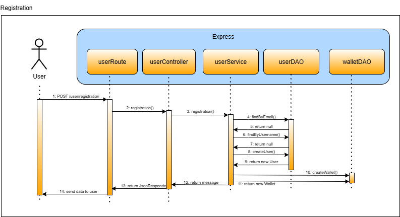

#### Login

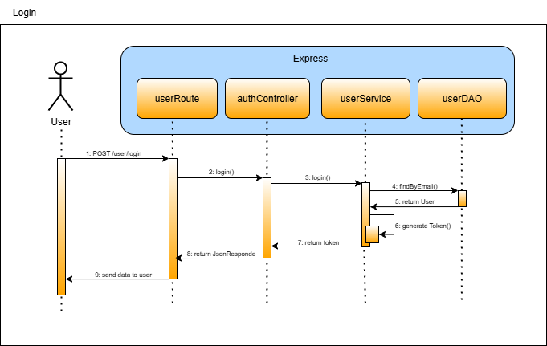

#### Crea Asta

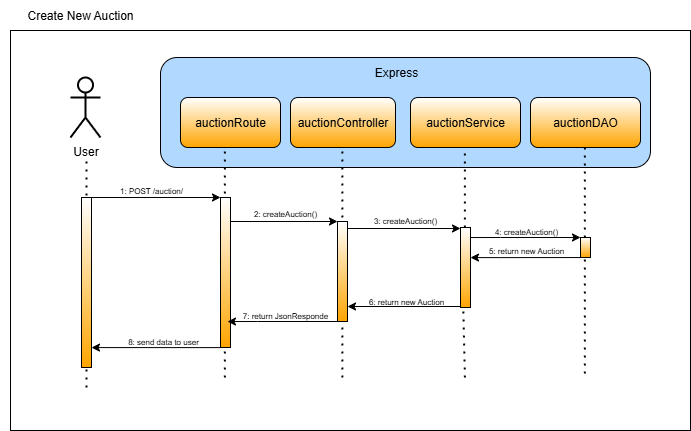

#### Inizio Asta

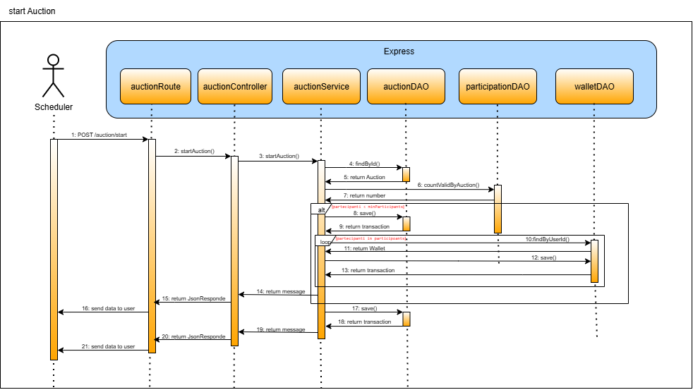

#### Chiusura Asta

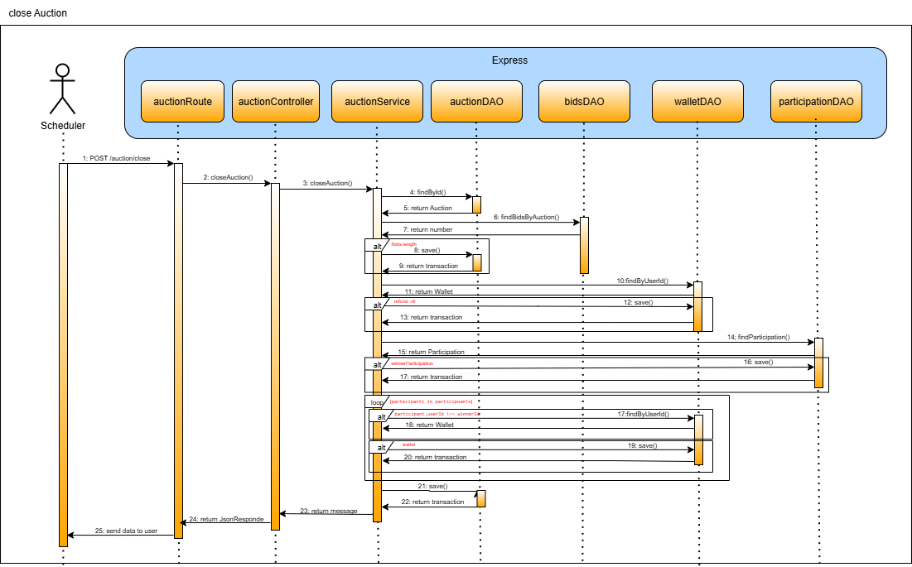

#### Aggiorna lo stato dell'asta

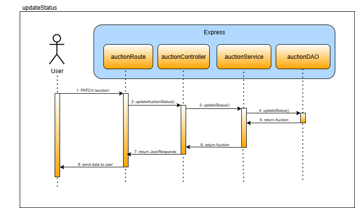

#### Visualizza elenco aste

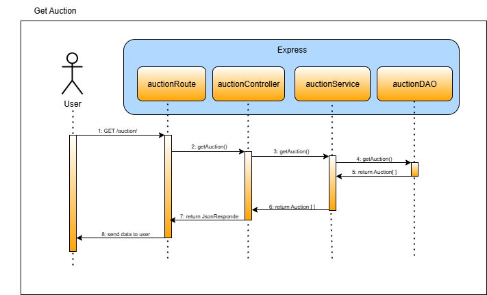

#### Visualizza puntate di un'asta in fase di rilancio

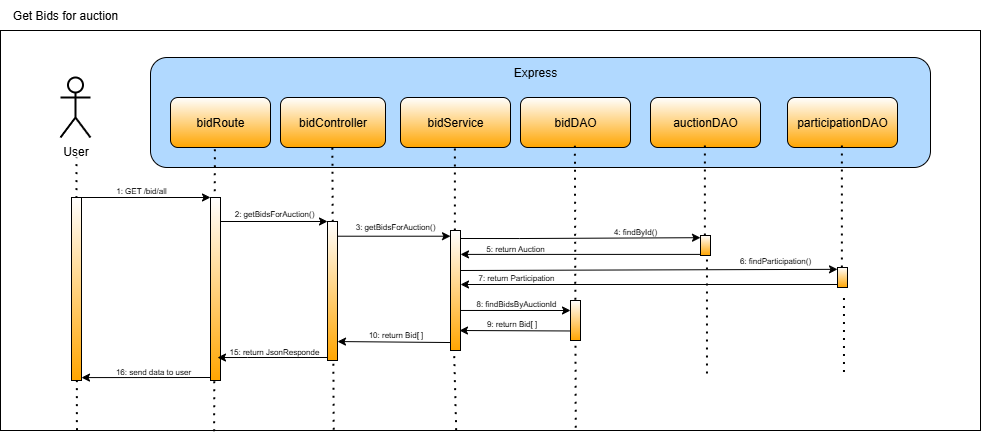

#### Iscrizione all'asta

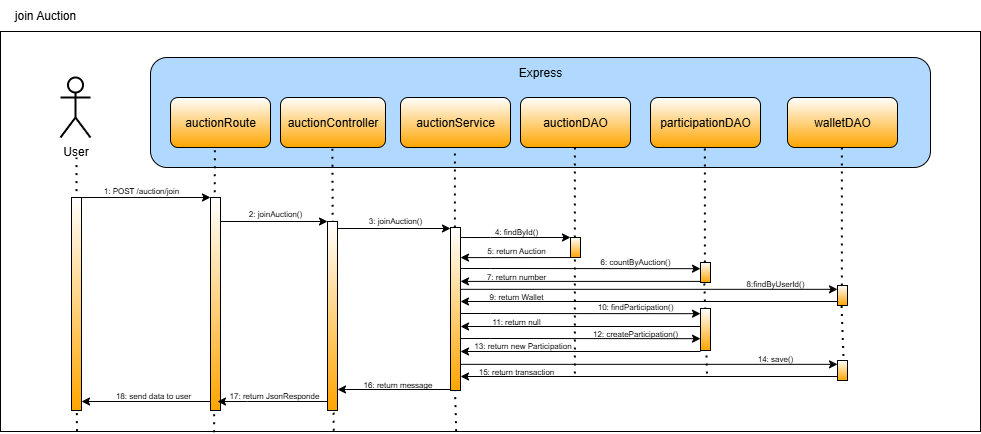

#### Esegui puntata

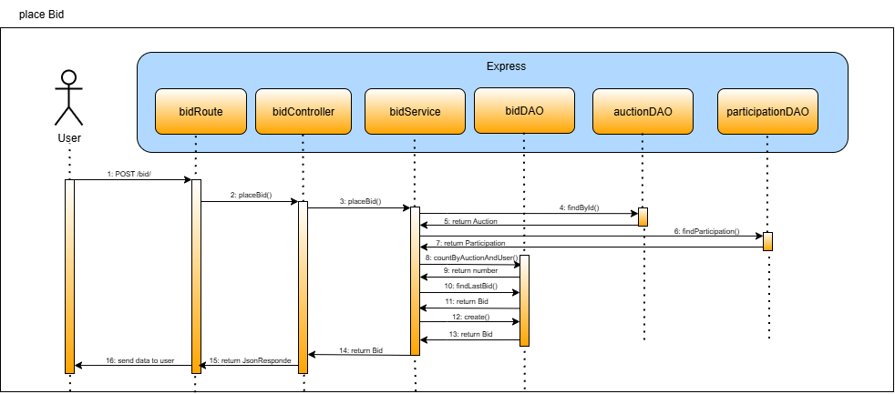

#### Verifica credito residuo

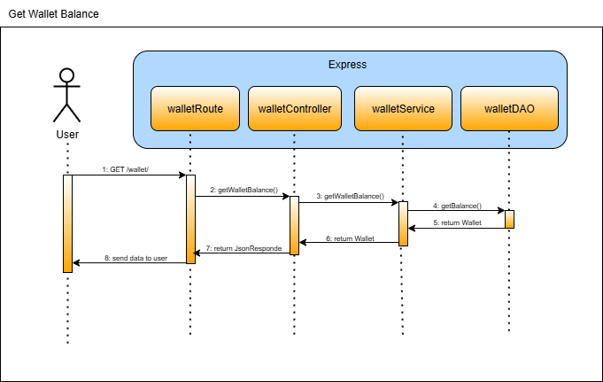

#### Visualizza storico aste

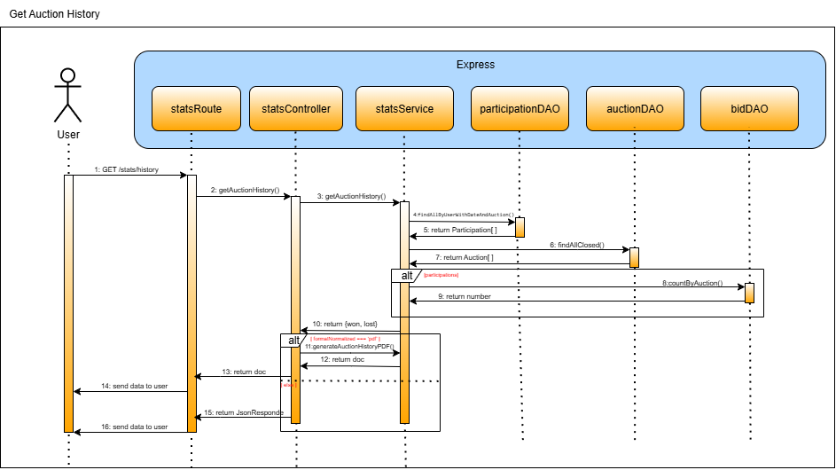

#### Visualizza spesa effettuata

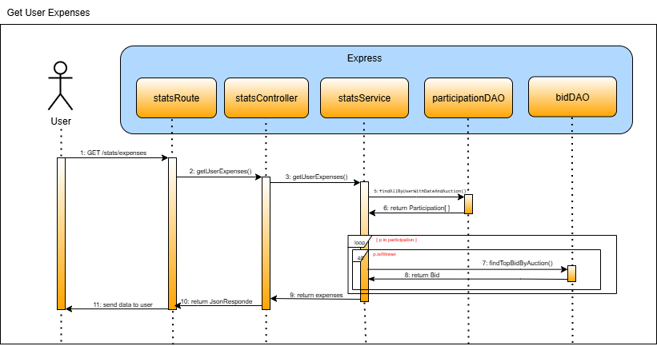

#### Visualizza statistiche globali

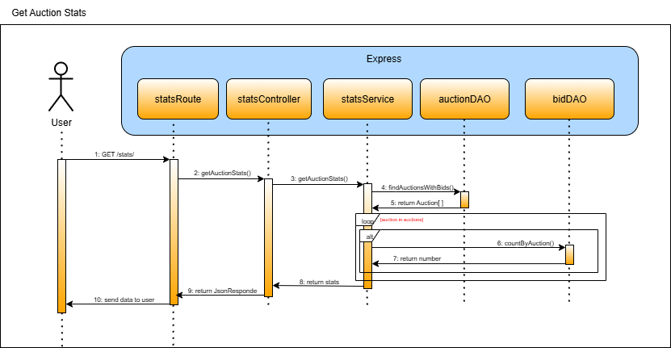

#### Ricarica Wallet

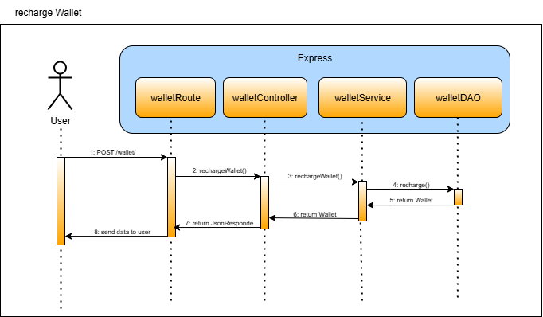

---

## Design Patterns Utilizzati nel Progetto

### Model - Controller - Service
Il progetto segue il pattern architetturale Model - Controller - Service, una struttura ampiamente adottata nello sviluppo di applicazioni backend per la sua capacità di favorire modularità, scalabilità e facilità di manutenzione, che a differenza del classico paradigma MVC (Model-View-Controller) omette la componente 'view', poiché in questo contesto non è prevista la gestione di interfacce utente. L’attenzione è quindi interamente rivolta alla strutturazione della logica applicativa e alla gestione dei dati.
##### MODEL:
 Il Model definisce la struttura dati dell’applicazione e gestisce l’interazione con il database. In questo progetto, i modelli sono implementati utilizzando Sequelize, un ORM per Node.js che consente di interfacciarsi con PostgreSQL in modo strutturato e ad alto livello. Sequelize permette di definire i modelli tramite classi o oggetti descrittivi, astraendo le query SQL sottostanti e garantendo un codice più chiaro, riutilizzabile e manutenibile.

 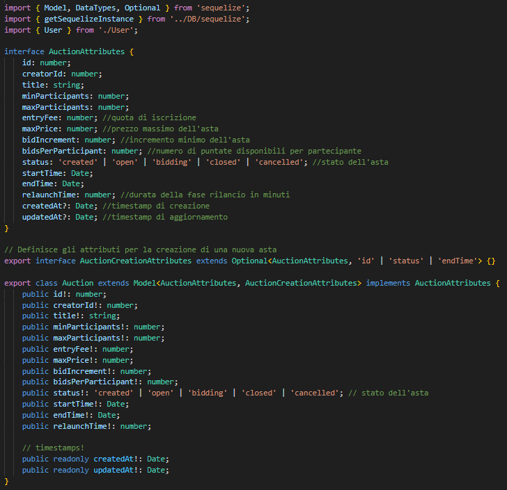

##### CONTROLLER:
 I Controller costituiscono il punto di ingresso per tutte le richieste HTTP indirizzate all’applicazione. Il loro compito è ricevere le richieste dal client, estrarre e validare i parametri necessari (con eventuale supporto dei middleware), e coordinare il flusso operativo. Una volta validati i dati, i Controller delegano l’elaborazione alla corrispondente classe Service, incaricata di eseguire la logica applicativa. 
 Oltre a smistare le richieste, i Controller sono responsabili della preparazione e formattazione delle risposte da restituire al client, comprensive di dati, messaggi di errore e codici di stato HTTP adeguati. Non contengono logica di business complessa, ma fungono da ponte tra il client e la logica applicativa, promuovendo una chiara separazione delle responsabilità e migliorando l’organizzazione del codice.

 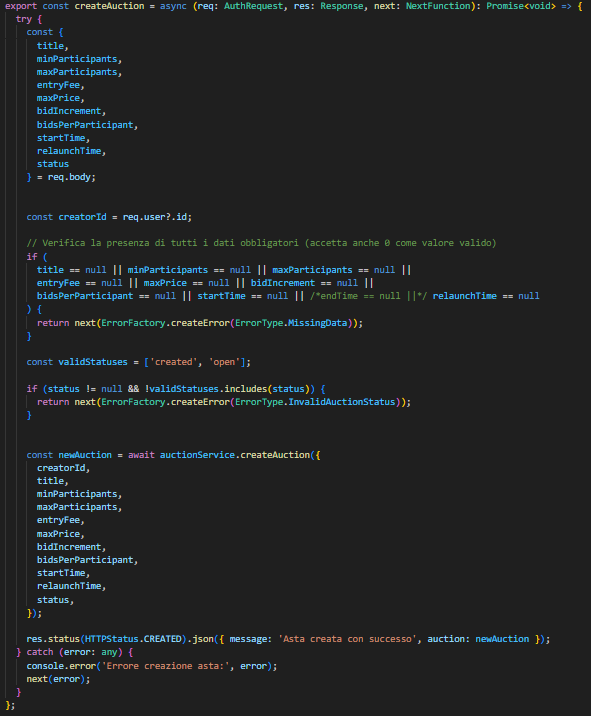

##### SERVICE:
 Il Service contengono la logica di business dell’applicazione. Nei service vengono implementate le funzionalità principali del sistema, come la gestione delle aste, il calcolo delle statistiche e la gestione dei portafogli degli utenti. . I Controller delegano ai Service l’esecuzione delle azioni, mantenendo così separati i ruoli: i Controller gestiscono il flusso delle richieste, mentre i Service si occupano dell’elaborazione vera e propria.

 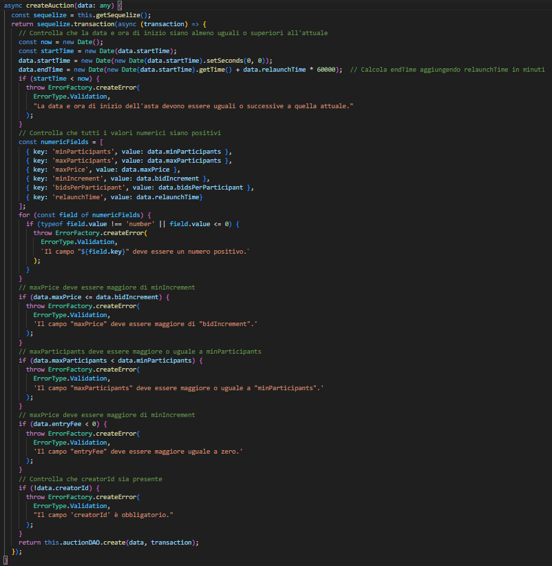


### Chain of Responsibility

Il **Chain of Responsibility** è un pattern comportamentale che consente di far transitare una richiesta attraverso una catena di gestori potenziali, finché uno di essi non se ne fa carico. Ogni gestore ha la possibilità di elaborare la richiesta oppure di passarla al successivo nella catena. Questo approccio permette di separare chi invia una richiesta da chi la elabora, rendendo l’assegnazione delle responsabilità più flessibile e scalabile.

Nel contesto di questo progetto, il pattern è stato adottato per strutturare le *middleware* sia a livello globale che specifico per gruppi di rotte. Invece di usare semplici funzioni, le middleware sono state modellate come classi, ognuna con due metodi fondamentali:

- `setNext`: collega il middleware corrente al successivo nella catena.
- `handle`: gestisce l’elaborazione della richiesta o la inoltra al gestore successivo.

Tutte le classi middleware derivano da una classe base comune (`BaseHandler`) e sovrascrivono i metodi definiti per implementare la propria logica specifica.

#### Vantaggi dell’approccio a catena

- **Isolamento delle responsabilità**  
  Ogni middleware si occupa esclusivamente di una singola responsabilità (es. autenticazione, validazione, parsing). Questo rende il codice più modulare, comprensibile e facilmente modificabile. Ad esempio, si può cambiare la logica di autorizzazione senza interferire con il parsing della richiesta o altre fasi.

- **Responsabilità distribuita**  
  Invece di accentrare tutta la logica (autenticazione, validazione, parsing, ecc.) in un'unica funzione complessa, ogni classe gestisce un compito ben definito, favorendo una progettazione pulita e facilmente testabile.

- **Espandibilità**  
  Aggiungere nuove middleware è semplice e non richiede modifiche sostanziali alla struttura esistente.

- **Ordine flessibile di esecuzione**  
  È possibile modificare l’ordine delle middleware in base alle necessità, ad esempio eseguendo la validazione prima dell’autenticazione, senza dover riscrivere la logica delle classi stesse.


I file a cui si fa riferimento si trovano nella cartella "src/middlewares".

  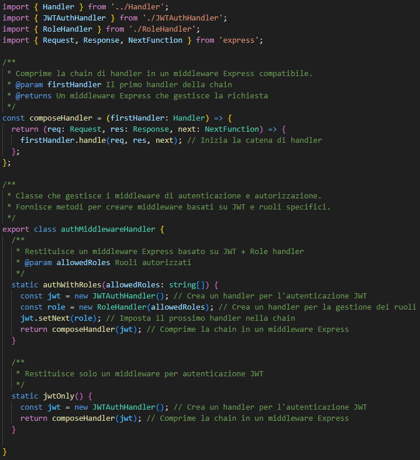


### Factory

Il **Factory Pattern** è un pattern creazionale utilizzato nella programmazione orientata agli oggetti per fornire un’interfaccia comune alla creazione di oggetti, delegando alle sottoclassi la decisione su quale tipo di oggetto istanziare. Questo approccio favorisce un basso accoppiamento, in quanto il codice non dipende direttamente da classi concrete.

In pratica, invece di creare oggetti tramite l’uso diretto del costruttore (`new`), si utilizza un metodo chiamato *factory method* che si occupa di istanziare e restituire l’oggetto richiesto. Questo è particolarmente utile quando il tipo esatto di oggetto da creare viene deciso a runtime o quando la logica di creazione richiede un controllo centralizzato.

Nel progetto, questo pattern è stato impiegato per gestire la creazione centralizzata degli errori. È stato prima definito un `enum` per identificare le varie tipologie di errore e successivamente è stato implementato il metodo `createError`, che permette di generare oggetti errore specifici semplicemente passando il tipo desiderato.

#### Perché è stato scelto questo pattern

- **Minore accoppiamento tra componenti**  
  Attraverso l’uso della factory, si evita che le classi che generano errori dipendano direttamente dalle implementazioni specifiche degli oggetti di errore. Questo migliora la modularità e facilita la manutenzione.

- **Gestione centralizzata degli errori**  
  Accentrando la creazione degli errori, si ottiene una gestione più coerente a livello applicativo. Inoltre, è più semplice integrare funzionalità trasversali come logging o metriche in un unico punto.

- **Maggiore flessibilità**  
  L’eventuale modifica della logica di creazione degli errori non comporta interventi nel codice delle classi che li utilizzano, rendendo l’architettura più flessibile e aperta all’estensione.

- **Codice più chiaro**  
  Separando la logica di istanziazione da quella di utilizzo, il codice diventa più ordinato e leggibile. Le classi chiamanti non si occupano più dei dettagli su come vengono costruiti gli errori.

I file a cui si fa riferimento si trovano nella cartella "src/factory".

  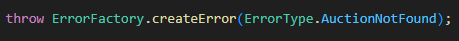

### DAO (Data Access Object)

Il **DAO Pattern** è un pattern strutturale utilizzato per isolare la logica di accesso ai dati dal resto dell'applicazione. Consente di definire un'interfaccia ben precisa per tutte le operazioni di lettura e scrittura sul database, mantenendo il codice più pulito, manutenibile e facilmente testabile.

Nel progetto, il DAO pattern è stato adottato per strutturare l’interazione con il database tramite **Sequelize ORM**. Ogni entità del dominio (es. User, Auction, Bid, Partipation, Wallet) dispone del proprio DAO dedicato, responsabile di gestire tutte le operazioni CRUD e query complesse.

#### Vantaggi dell’adozione del DAO Pattern

- **Separazione delle responsabilità**  
  La logica applicativa (controller o service) non deve preoccuparsi dei dettagli di accesso ai dati. Questo favorisce un’architettura pulita e modulare.

- **Riutilizzabilità**  
  I metodi di accesso al database, una volta definiti in un DAO, possono essere riutilizzati in più parti dell’applicazione senza duplicazione di codice.

- **Manutenibilità**  
  Eventuali modifiche alla struttura del database o alle query si riflettono solo all’interno del DAO, senza impattare il resto dell’applicazione.

- **Testabilità**  
  Grazie all’astrazione fornita dal DAO, è più semplice scrivere test unitari e mockare le dipendenze legate al database.

- **Centralizzazione delle query complesse**  
  Le query SQL avanzate o le interazioni con più tabelle vengono incapsulate all’interno dei DAO, mantenendo il codice più leggibile altrove.


I file relativi ai DAO si trovano nella cartella `src/dao`.


## Singleton

Il **Singleton** è un pattern di progettazione appartenente alla categoria dei pattern creazionali. Il suo scopo principale è garantire che una determinata classe venga istanziata una sola volta durante l'intera esecuzione dell'applicazione, fornendo un punto di accesso globale a quell’istanza. Questo approccio è particolarmente utile in tutti quei casi in cui un’unica risorsa condivisa deve coordinare o gestire comportamenti comuni a più componenti del sistema.

Il pattern si basa generalmente su tre elementi fondamentali:

- **Costruttore privato**: blocca la possibilità di creare nuove istanze dall’esterno della classe.
- **Metodo statico (o proprietà statica)**: consente di ottenere l’unica istanza esistente.
- **Variabile statica**: memorizza l’istanza Singleton, creata una sola volta e riutilizzata a ogni accesso successivo.

Nel backend sviluppato, è stato adottato il pattern Singleton per la gestione dei Data Access Object (DAO), al fine di garantire un'unica istanza condivisa per ciascun DAO e ottimizzare così l'accesso alle risorse persistenti

### Vantaggi derivanti dall’utilizzo del pattern

- **Stato coerente e condiviso**  
  Il pattern garantisce che tutte le componenti dell’applicazione accedano alla stessa istanza, assicurando coerenza nello stato e nei dati condivisi.

- **Controllo delle risorse condivise**  
  Centralizzando l’accesso a componenti critici, si evita che più istanze tentino di manipolare contemporaneamente lo stesso stato, prevenendo condizioni di gara o conflitti.

- **Ottimizzazione dell’uso delle risorse**  
  Avere una sola istanza riduce il carico legato alla creazione/rimozione di connessioni multiple e favorisce le prestazioni, soprattutto in ambienti con accessi frequenti.

- **Evitare istanziazioni multiple involontarie**  
  Il pattern impedisce che, per errore o distrazione, vengano creati oggetti duplicati della stessa classe — situazione che, in contesti come quello delle code o delle connessioni, potrebbe causare malfunzionamenti gravi o rallentamenti del sistema.

- **Facilità di debug e manutenzione**  
  Disporre di un’unica istanza semplifica l’individuazione e la correzione dei problemi, poiché è chiaro dove intervenire in caso di errori o malfunzionamenti.

I file a cui si fa riferimento si trovano nella cartella "src/dao".

  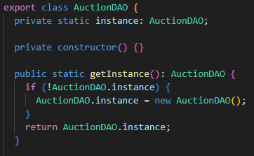

---

### Test API

Tutte le rotte sono state provate utilizzando Postman, ecco il link per ottenere le raccolte e l'ambiente per provare l'applicazione:

[Scarica il Json della collection Postman](documentazione/ProgettoPA.postman_collection.json)

### Testing jest
Il progetto include una suite di test automatizzati scritti in TypeScript usando Jest, con l’obiettivo di verificare il corretto funzionamento delle logiche di business principali.
Tutti i test si trovano nella cartella
```bash
src/test/
```
Ogni file di test verifica in isolamento il comportamento di un servizio specifico o di una parte dell'applicazione. I componenti esterni (come i DAO per l'accesso ai dati) vengono mockati per isolare la logica da testare.
è possibile eseguire i test con:
```bash
npm test
```
oppure direttamente con:
```bash
npx jest
```

Nel dettaglio:
1. authMiddlewareHandler.test.ts
Verifica il comportamento del middleware di autenticazione e autorizzazione (authWithRoles), che protegge le rotte in base al ruolo utente contenuto nel token JWT.

- Blocca le richieste prive di header Authorization
- Rifiuta i token JWT non validi
- Rifiuta accessi con ruolo non autorizzato
- Permette il passaggio al next() solo se token e ruolo sono validi

  Utilizza jsonwebtoken per simulare token reali e verifica che gli errori siano correttamente inoltrati.

2. joinAuction.test.ts
Testa la logica del metodo joinAuction del servizio AuctionService, che gestisce la partecipazione di un utente a un'asta.

- Rifiuta la partecipazione se l’asta non è aperta
- Rifiuta se l’utente ha un saldo insufficiente
- Accetta la partecipazione se tutte le condizioni sono soddisfatte, aggiornando correttamente il wallet e registrando la partecipazione

  Tutti i DAO e le transazioni Sequelize sono mockati per simulare condizioni di successo e fallimento in sicurezza.

3. userExpenses.test.ts
Testa la funzione getUserExpenses del StatsService, che calcola quanto ha speso un utente su un intervallo temporale.

- Somma correttamente commissioni di partecipazione e importi offerti in caso di vittoria
- Gestisce correttamente il caso in cui non ci siano partecipazioni (spesa totale = 0)

  I DAO vengono simulati per restituire partecipazioni e offerte fittizie. I valori sono arrotondati e formattati come stringhe con due decimali.

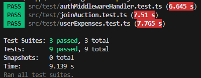


## Sviluppi futuri 
### Gestione delle code di puntata con BullMQ e Redis

Per migliorare la gestione delle puntate durante la fase di rilancio, soprattutto in presenza di più aste attive contemporaneamente, si prevede l'integrazione di **BullMQ** insieme a **Redis**.

#### Obiettivi

- **Gestione concorrente** delle puntate su più aste attive nello stesso momento.
- **Coda separata per ogni asta**, così da isolare i flussi di puntata.
- **Ordine garantito** delle puntate grazie al sistema FIFO di BullMQ.
- **Elaborazione asincrona** per migliorare le performance e ridurre il carico.
- **Scalabilità**, con possibilità di eseguire più worker in parallelo.
- **Monitoraggio e debugging** attraverso strumenti integrati.

#### Tecnologie previste

- **BullMQ**: sistema di code per Node.js basato su Redis.
- **Redis**: archivio dati in-memory veloce, usato per gestire e conservare le code.

#### Vantaggi

- Riduzione del rischio di errori nelle puntate (es. doppie puntate o fuori ordine)
- Esperienza utente più fluida, specialmente nelle fasi finali dell’asta
- Sistema pronto per la **scalabilità** e per future estensioni (es. WebSocket)

> Questa funzionalità non è ancora implementata, ma costituisce una delle principali priorità per le prossime versioni del progetto.
